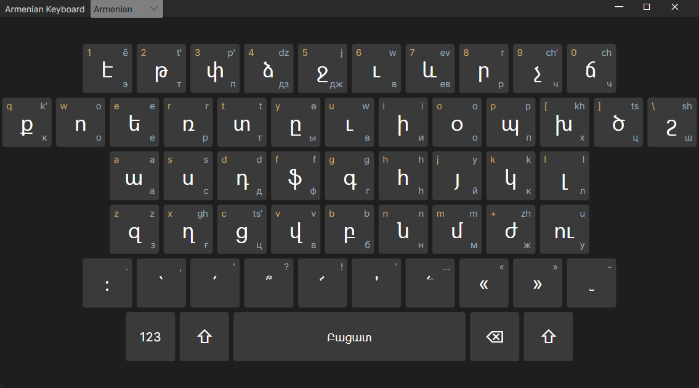

# OnScreenKeyboard

A floating on-screen **Armenian keyboard** for Windows. Click keys to type Armenian Unicode directly into whichever app has focus — no need to install an Armenian keyboard layout in the OS.



## Why

If you only occasionally need to type Armenian (chatting with family, sending an email, labelling a file) but don't want to juggle Windows input languages or memorise a layout, this gives you a point-and-click keyboard that always floats on top.

## Features

- **Always-on-top floating window** that never steals focus — your target app keeps the caret, clicks inject characters into it.
- **No OS layout required.** Characters are sent as Unicode via `SendInput`, independent of the current keyboard layout.
- **Phonetic labels on every key.** Each key shows:
  - QWERTY hint (top-left, what physical key it maps to on a Windows Armenian phonetic layout)
  - Latin transliteration (top-right)
  - Armenian letter (center, the one that gets typed)
  - Russian equivalent (bottom-right)
- **Shift / Caps Lock aware.** Physical Shift and Caps Lock toggle upper-case live, and the on-screen ⇧ toggle does the same.
- **Numbers, punctuation, and off-layout letters** (`ժ`, `ու`, `խ`, `ծ`, `շ`) are all reachable.
- **Pluggable layouts.** Russian, Georgian, or any other language can be added as a single `.cs` file — see [CLAUDE.md](CLAUDE.md#adding-a-language).

## Install

Grab the latest `OnScreenKeyboard` folder from [Releases](../../releases), unzip anywhere, and run `OnScreenKeyboard.exe`. No .NET runtime required — the exe is Native AOT, fully self-contained.

## Usage

1. Launch `OnScreenKeyboard.exe`.
2. Click into the app you want to type into (browser, Word, Discord, anything).
3. Click keys on the floating keyboard — characters appear in the focused app.
4. Hold physical Shift / press ⇧ on the keyboard for upper-case. `123` toggles the number row. `Բացատ` is space, `⌫` is backspace.

## Platform support

- **Windows 10/11 (x64):** full support, what the Releases ship.
- **Linux (X11):** works via `xdotool` (must be installed). Untested on Wayland — should be fine under XWayland, native Wayland clients need `ydotool` or similar.
- **macOS:** not yet implemented. Input-sending is behind an `IKeystrokeSender` interface, so adding a `MacOsKeystrokeSender` would be the main work.

## Build from source

Requirements: .NET 10 SDK. For Release (AOT) builds: Visual Studio Build Tools 2022 with the "Desktop development with C++" workload.

```
cd OnScreenKeyboard
dotnet run                                    # run from source (Debug)
dotnet publish -c Release -r win-x64          # build redistributable
```

Release output is in `bin/Release/net10.0/win-x64/publish/` — ship the whole folder.

## Adding a language

One file in `OnScreenKeyboard/Layouts/` + one line in `MainWindowViewModel.BuildLayouts()`. Full instructions in [CLAUDE.md](CLAUDE.md#adding-a-language); copy `ArmenianLayout.cs` as a template.

## Stack

Avalonia 12 (UI) · CommunityToolkit.MVVM 8 (bindings) · .NET 10 · Native AOT for Release.
